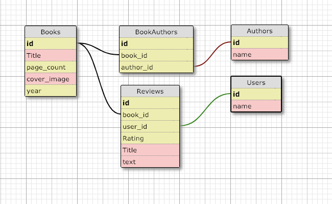

# README




To deploy the application run the following commands in the terminal:
``` bash
bundle install
bundle update
rails db{create,migrate,seed}
```

To start the application, run:
``` bash
rails s
```

To run the test suite, run:
``` bash
rspec
```

Group DTR: Project: Book Club

Group Member Names: Peter Lapicola, Julia Marco

Goals and Expectations for the Project (What does each group member hope to get out of this project? What do we want to achieve as a team? How will we know that we're successful?):

One of our goals is to TDD at all times during the projects. Also, get a better learning of the use of Rails. We would like to get to the extensions part and also try to timebox the styling part so it doesn't take too much time.

Team strengths & collaboration styles: We both would like to be pairing at the begginning of the project at least, and probably re-DTR and see if we want to do further functionality or styling more independently.

How we can use our strengths to overcome obstacles: Peter can help the team to stay focused and calm. Julia can help with communication.

Schedule Expectations (When are we available to work together and individually? What constraints do we have?): We can work after school, we both have a lot of availability in general.

Communication Expectations (How and often will we communicate? How do we keep lines of communication open? How will we make decisions as a team?): Communicate in person everyday as well as use slack.

Abilities & Growth Expectations: We both want to get better at Active Record.

Expectations for giving and receiving feedback: Expect honest and constructive feedback.

Project management tools we will use: We will be using Waffle

